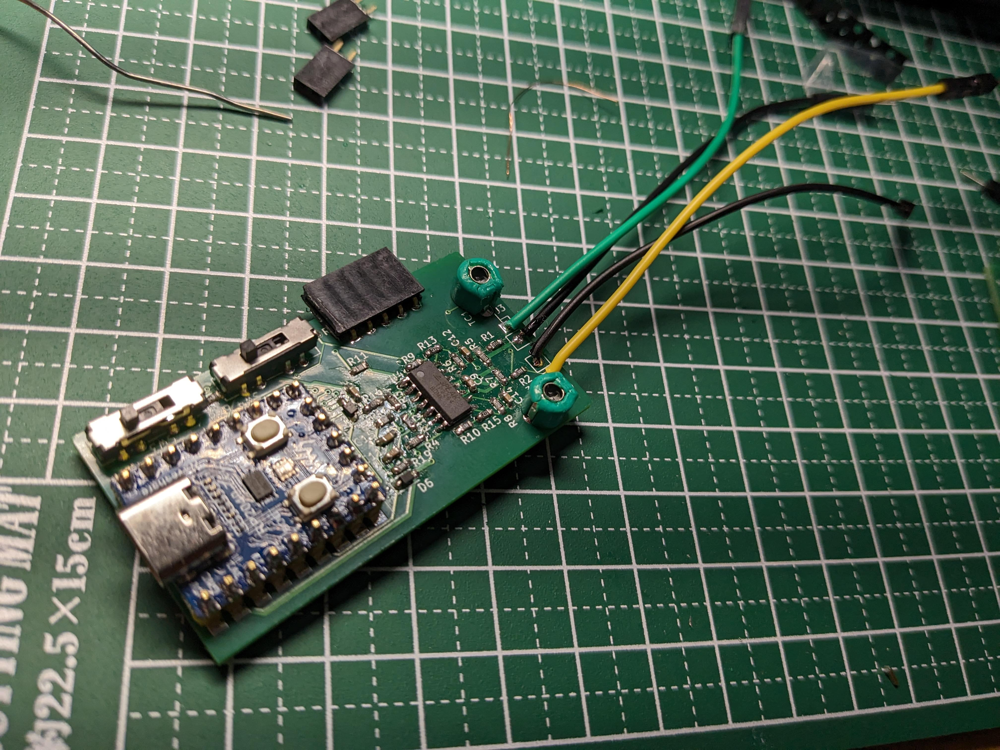
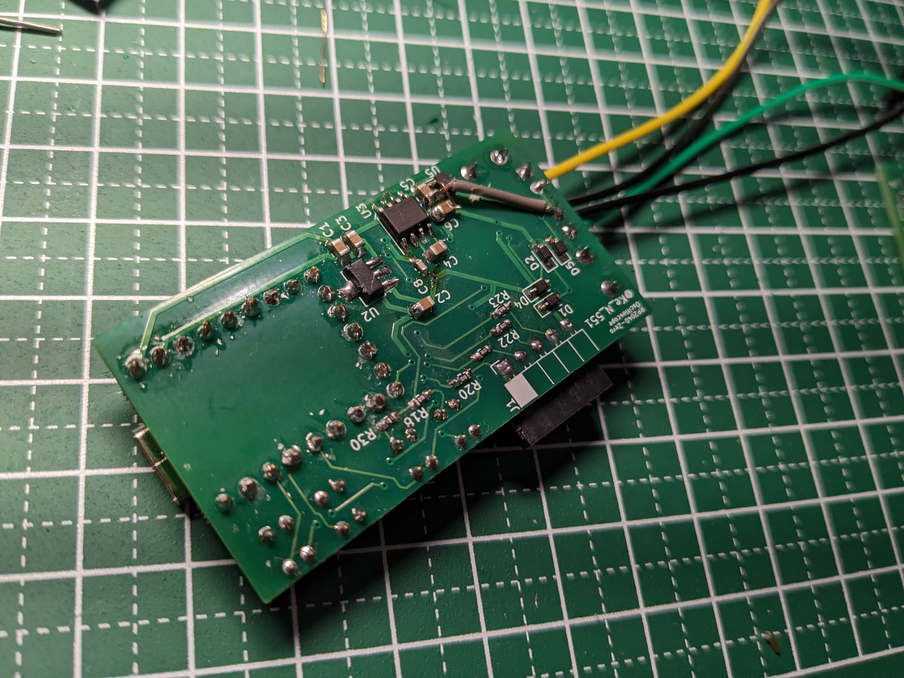
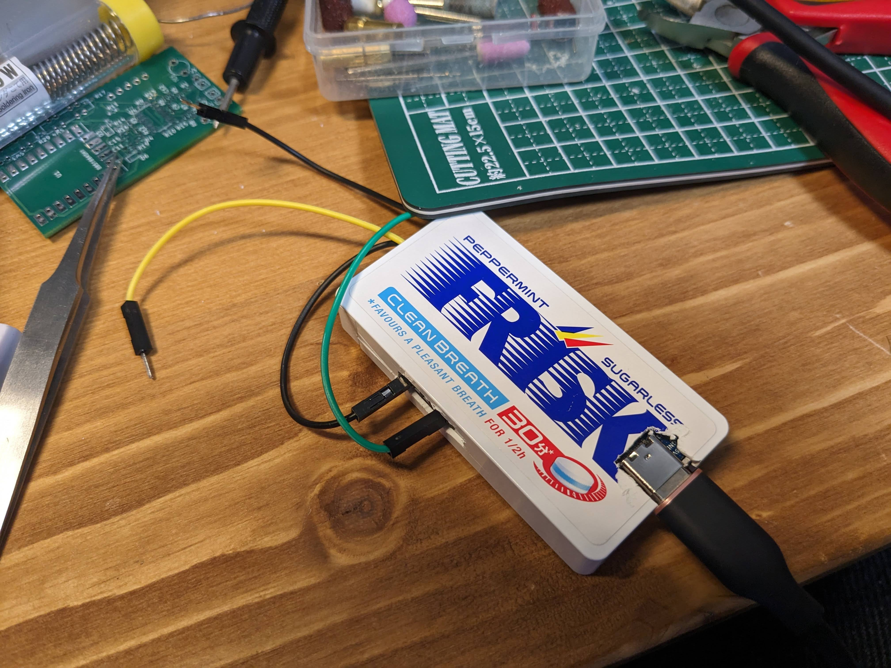
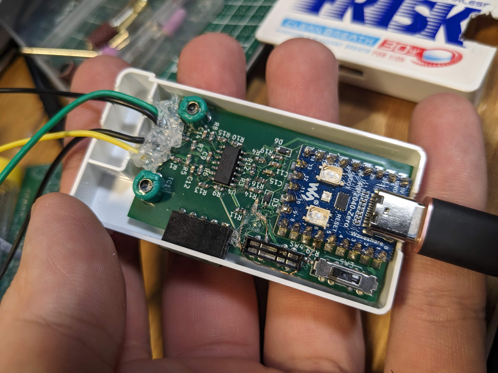

# rp2040-zero-oscilloscope
[picoLabo](https://picolabo.org/)様によるRaspberry Pi Pico オシロスコープと同等のものを、Waveshare社の[RP2040-Zero](https://www.waveshare.com/wiki/RP2040-Zero)を使って実現する、RP2040-Zero-オシロスコープ の回路図です。

フリスクのケースに（~~無理やり~~）入るサイズです。

## 回路図
[picoLabo](https://picolabo.org/)様の[Raspberry Pi Pico用オシロスコープ基板DIYキット PL2302KIT](https://picolabo.org/pl2302kit/)をベースにしています。回路図の変更点・差分は以下の通りです。

### 使用ライブラリ
* [RP2040-Zero-KiCAD](https://github.com/dj505/RP2040-Zero-KiCAD) (by @dj505)