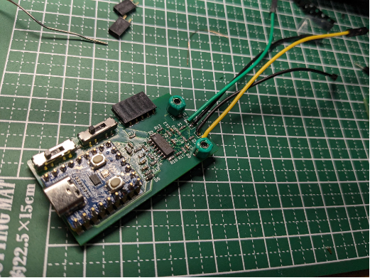
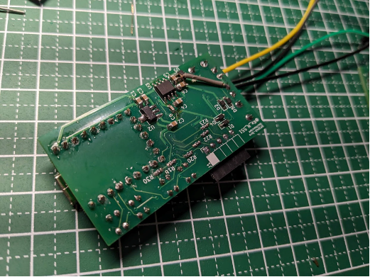
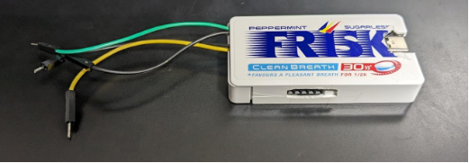
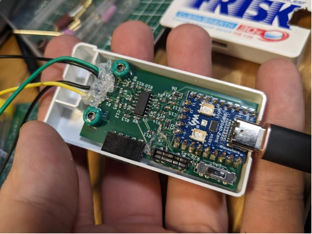

# rp2040-zero-oscilloscope
[picoLabo](https://picolabo.org/)様によるRaspberry Pi Pico オシロスコープと同等のものを、Waveshare社の[RP2040-Zero](https://www.waveshare.com/wiki/RP2040-Zero)を使って実現する、RP2040-Zero-オシロスコープ の回路図です。

> [!CAUTION]
> 本バージョン基板（v1）は回路の**配線ミス**があり、**パターンカット・空中配線**が必須です。
>

フリスクのケースに（~~無理やり~~）入るサイズです。

## **注意**
本バージョンの回路には**間違いがあります。**

## 回路図
[picoLabo](https://picolabo.org/)様の[Raspberry Pi Pico用オシロスコープ基板DIYキット PL2302KIT](https://picolabo.org/pl2302kit/)をベースにしています。小サイズ化のため、ベースの回路図から以下のように変更しています。

* アナログ入力をAC/DC両対応からDCのみに限定
* デジタル入力を8ch→4chに削減
* 信号出力端子を削除

### 使用ライブラリ
* [RP2040-Zero-KiCAD](https://github.com/dj505/RP2040-Zero-KiCAD) (by @dj505)